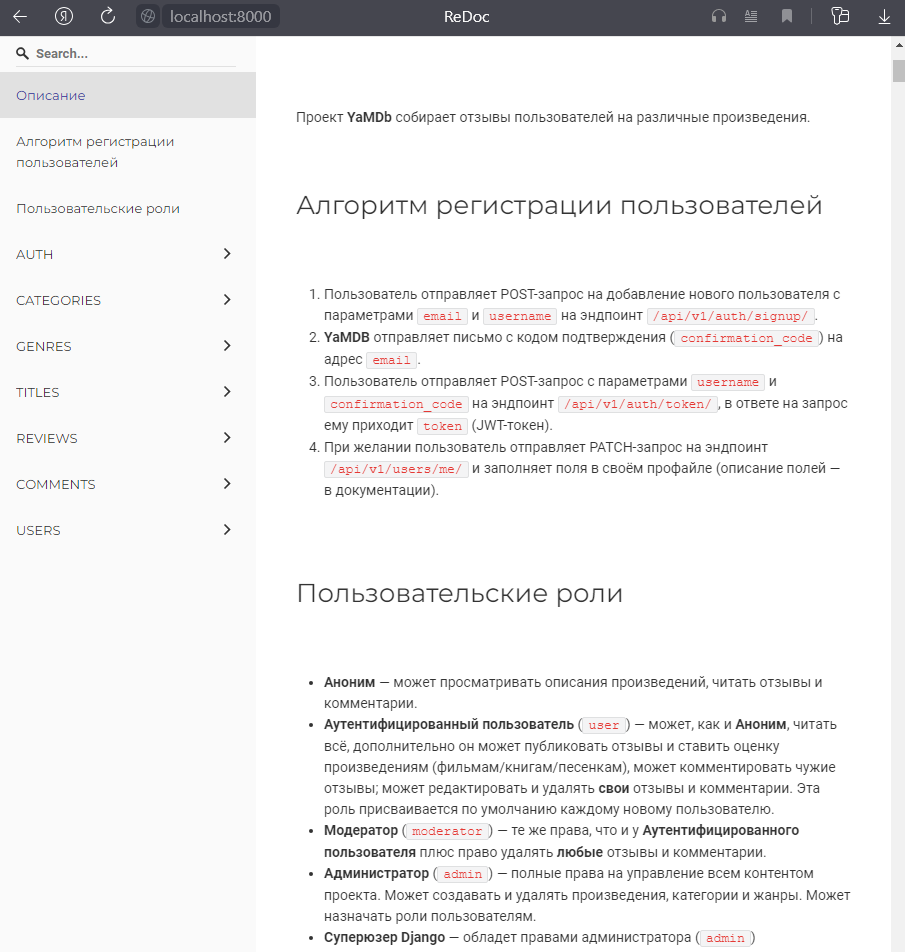

# api_yamdb
### Как запустить проект:

Клонировать репозиторий и перейти в него в командной строке:

```
git clone https://github.com/mixer-sys/api_yamdb.git
```

```
cd api_yamdb
```

Cоздать и активировать виртуальное окружение:

```
python3 -m venv env
```

```
source env/bin/activate
```

Установить зависимости из файла requirements.txt:

```
python3 -m pip install --upgrade pip
```

```
pip install -r requirements.txt
```

Выполнить миграции:

```
python3 manage.py migrate
```

Запустить проект:

```
python3 manage.py runserver
```
### Как посмотреть возможности проекта:

Перейти по адресу: http://localhost:8000/redoc/


